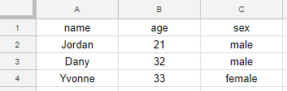

# google-sheet-proxy
A ready-to-use PHP proxy to allow easy AJAX access to a Google Spreadsheet, without installing a web server.

This script was created to help web coding beginners learn to use AJAX with their own data, without installing a web server or learning back-end technologies. It was created as part of the Mobile and Web Technologies course of the University of Victoria to **teach the concept of Web API** to first-time programmers.

After the teacher places this file on a web server, the students only need **basic understanding of HTML and JavaScript** to create webpages backed on online data created by themselves, stored in a **Google Spreadsheet**.

# Why would you use this script?

This script is intended to aid the teaching of any technology that benefits from storing data in a Google Spreadsheet.

When teaching non-programmers about web technologies, there's a difficulty jump between basic HTML/CSS/JavaScript and AJAX. Most students don't understand the concept of API even after hours of experimenting with [Postman](https://www.getpostman.com/), because they have no control and don't feel involved with the process. The ideal way to teach AJAX is by making the students consume an API they created themselves so they have ownership of their data. Public APIs can be used for teaching but they are usually over-complicated for a first contact.

We found that the best way to teach this topic is to let students prepare their own data in a Google Spreadsheet and consume it themselves. However, they will have to install a web server to make AJAX calls without getting the error *"XMLHttpRequest cannot load <API-URL-HERE>. No 'Access-Control-Allow-Origin' header is present on the requested resource. Origin 'null' is therefore not allowed access."*. As a solution, if students use this proxy to access their spreadsheet, they won't get this error and won't need to install a web server either, streamlining the learning process.

# Usage

1. The teacher places the file **proxy.php** in a web server.
2. The student creates a Google Spreadsheet with their data, where the **first row contains the column headers** and the rest of the rows contain the data, for example:

   

3. The student shares the spreadsheet (Menu *"File" - "Share.." - "Get Shareable link"*) and obtains an URL for the spreadsheet, which is in the following syntax:

   _docs.google.com/spreadsheets/d/**<LONG_CODE_HERE>**/edit?usp=sharing_

   The special code in <LONG_CODE_HERE> is the **File Key** and the student should take note of it.
4. Now the student can use AJAX to access the spreadsheet data using the proxy with the following parameters:

   <URL-TO-YOUR-SCRIPT>/proxy.php?key=**<YOUR_KEY>**&sheet=**<YOUR_SHEET>**

   , where <YOUR_SHEET> is the name of the sheet inside the spreadsheet document (on the bottom of the spreadsheet, usually "Sheet1"). This allows to use different sheets as different "Database tables". Following the example above, the proxy would return the following JSON object (with the proper Access-Control-Allow-Origin header):

   ```[{"name":"Jordan","age":"21","sex":"male"},{"name":"Dany","age":"32","sex":"male"},{"name":"Yvonne","age":"33","sex":"female"}]```

# Example with JavaScript

The "example" folder contains a simple JavaScript example (~10 lines of code) you can use to test your proxy against the spreadsheet in the usage example. It uses the jQuery library. Make sure the spreadsheet's row headers contain no spaces as they will be turned into javascript variables automatically (e.g. "First name" doesn't work, use "First_name" instead).

# Security disclaimer

This script is not meant to be used in application development, but only to fascilitate experimentation in an academic environment. The proxy.php file should ideally be removed from your web server after it fulfills its purpose (e.g. after the course ends), or at least moved to a different folder so that people cannot abuse it easily.

# License and credit

Free to use for everyone. If you use this script, please Github star this repository or mention the repo's url, it will make us happy.