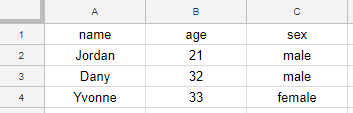

# google-sheet-proxy
A ready-to-use PHP proxy to allow easy AJAX access to Google Spreadsheets, without installing a web server.

This script was created to help web coding beginners learn to use AJAX with their own data, without installing a web server or learning back-end technologies. It was created as part of the Mobile and Web Technologies course of the University of Victoria to **teach the concept of Web API** (to first-time programmers).

After the teacher places this file on a web server, all the students need is **basic understanding of HTML and JavaScript** to create simple webpages with online data created by themselves, stored in a **Google Spreadsheet**.

# Why would you use this script?

This script is intended to aid the teaching of any technology that benefits from storing data in a Google Spreadsheet.

When teaching non-programmers about web technologies, there difficulty jump between basic HTML/CSS/JavaScript and AJAX. Most students don't understand the concept of API even after hours of experimenting with Postman, because they have no control over anything and don't feel involved with the process. The ideal way to teach AJAX is by making the students consume an API they created by themselves so they have ownership of their data. Although public APIs can be used for teaching, they are usually confusing.

We found that the best way to teach this topic is to let students prepare their own data in a Google Spreadsheet and consume it themselves. However, they will have to install a web server to make AJAX calls without getting the error *"XMLHttpRequest cannot load <API-URL-HERE>. No 'Access-Control-Allow-Origin' header is present on the requested resource. Origin 'null' is therefore not allowed access."*. If the students use this script to access their spreadsheet, they won't get this error and won't need to install a web server either, streamlining the learning process.

# Usage

1. The teacher places this script in a web server.
2. The student creates a Google Spreadsheet with their data, where the **first row contains the column headers** and the rest of the rows contain the data, for example:

3. The student shares the spreadsheet (Menu *"File" - "Share.." - "Get Shareable link"*) and obtains an URL for the spreadsheet, in the following form (notice the portion in bold):

https://docs.google.com/spreadsheets/d/**151DckEKby3TAByEgeQtoBwSW6GszhvQJ4qatNpaxh4U**/edit?usp=sharing

The bold portion is the **File Key** and the student should take note of it.
4. Now the student can use AJAX to access the spreadsheet data using the proxy script with the following parameters:

http://PATH-TO-YOUR-SCRIPT/proxy.php?key=**<YOUR_KEY>**&sheet=**<YOUR_SHEET>**

, where <YOUR_SHEET> is the name of the sheet inside the spreadsheet document (on the bottom of the spreadsheet, usually "Sheet1"). This allows to use different sheets as different "Database tables".
